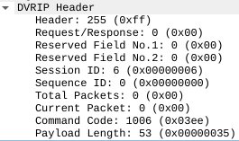
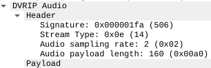
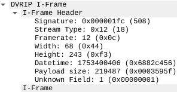
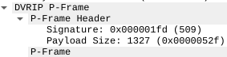
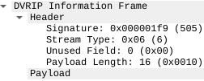

# DVRIP_analysis
A Wireshark dissector for DVRIP/Sofia protocol found in Xiongmai based IP cameras

Table of Contents
=================
* [Test Device](#test-device)
* [DVRIP/Sofia Commnd Message](#dvripsofia-command-message)
* [Audio Header](#audio-header)
* [I-Frame Header](#i-frame-header)
* [P-Frame Header](#p-frame-header)
* [E-Frame Header](#e-frame-header)

# Test Device

This dissector is based on a DVRIP Wireshark Dissector for Port 37777 (Dahua IP camera), which can be found here: https://github.com/r4bit999/dvrip-analysis/tree/master

Tested on Besder 6024PB-XMA501 IP camera:

```
Model: XM530_50X50-WG_8M
Firmware version: V5.00.R02.00030747.10010.349f17
```

# DVRIP/Sofia Command Message




# Audio Header




# I-Frame Header




# P-Frame Header




# E-Frame Header


