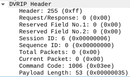
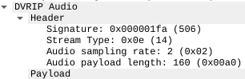
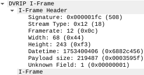
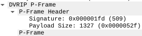
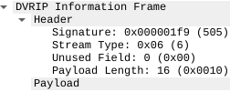

# DVRIP_analysis
A Wireshark dissector for DVRIP/Sofia protocol found in Xiongmai based IP cameras
Full writeup of a sample IP camera is available at [Besder 6024PB-XMA501 IP camera security investigation](https://github.com/KostasEreksonas/Besder-6024PB-XMA501-ip-camera-security-investigation) repository.

Table of Contents
=================
* [Test Device](#test-device)
* [DVRIP/Sofia Commnd Message](#dvripsofia-command-message)
* [Audio Header](#audio-header)
* [I-Frame Header](#i-frame-header)
* [P-Frame Header](#p-frame-header)
* [E-Frame Header](#e-frame-header)

# Test Device

This dissector is based on a DVRIP Wireshark Dissector for Port 37777 (Dahua IP camera), which can be found here: https://github.com/r4bit999/dvrip-analysis/tree/master

Tested on Besder 6024PB-XMA501 IP camera:

```
Model: XM530_50X50-WG_8M
Firmware version: V5.00.R02.00030747.10010.349f17
```

Media frames are saved as bytes in `/tmp` directory (file format: 'pinfo.number'_'frame_name').

DVRIP/Sofia media payloads have their own headers. All media payload header fields (except signature) are reordered to little-endian (LE) to extract their exact value.

Media payload headers were reconstructed based on [Xiongmai bitstream frame format document](https://www.scribd.com/document/669666260/%E7%A0%81%E6%B5%81%E5%B8%A7%E6%A0%BC%E5%BC%8F%E6%96%87%E6%A1%A3).

# DVRIP/Sofia Command Message

Header description of a single DVRIP/Sofia message is based on [Digital Video Recorder Interface Protocol document](https://github.com/OpenIPC/python-dvr/blob/master/doc/%E9%9B%84%E8%BF%88%E6%95%B0%E5%AD%97%E8%A7%86%E9%A2%91%E5%BD%95%E5%83%8F%E6%9C%BA%E6%8E%A5%E5%8F%A3%E5%8D%8F%E8%AE%AE_V1.0.0.pdf), the actual diagram being on page 7.




1. BIT 0 - message header byte, fixed as 0xFF.
2. BIT 1 - observed to be equal to 0 for requests and equal to 1 for responses from the IP camera.
3. BIT 2 - reserved byte 1:
    * When H.265 video codec is used (BIT4 = 0x12 on I-Frame header), this value is equal to 1.
    * When H.264 video codec is used (BIT4 = 0x02 on I-Frame header), this value is equal to 0.
4. BIT 3 - reserved byte 2:
    * When H.264 video codec is used, value of this BIT is equal to 128 on DVRIP messages containing audio frames.
    * Otherwise, BIT 3 value is equal to 0. 
5. BIT 4-7 - session ID. Assigned by the camera after successful login. Needs to be present in every subsequent message.
6. BIT 8-11 - sequence number. Increments from 0 after startup, and after reaching the (unknown) maximum, starts from 0 again.
7. BIT 12 - total number of packets in a single message. Value of 0 or 1 indicate a single message per packet. 
8. BIT 13 - number of a current packet in message. Meaningful only when the value of total packets (BIT 12) is greater than 1.
9. BIT 14-15 - command code (also called message id). The code defines what action to perform.
10. BIT 16-19 - data (payload) length. Length of a JSON payload, which starts immediately after DVRIP/Sofia header.

# Audio Header




1. BIT 0-3 - signature
2. BIT 4 - audio codec (0x0e = G711A)
3. BIT 5 - sampling rate (0x02 = 8kHz sampling)
4. BIT 6-7 - length of audio payload

# I-Frame Header




1. BIT 0-3 - signature
2. BIT 4 - video codec (0x01 = MPEG4, 0x02 = H.264, 0x12 = H.265)
3. BIT 5 - encoded framerate (variable; 1-25 for PAL, 1-30 for NTSC)
4. BIT 6 - low 8 bits of image width; the value is actual width divided by 8
5. BIT 7 - low 8 bits of image height; the value is actual height divided by 8
6. BIT 8-11 - datetime of the capture
7. BIT 12-15 - length of I-Frame payload
8. BIT 16-19 - first 4 bits of an I-Frame payload

Same exact header fields are shared between I-Frames (FC) and snapshots (FE).

# P-Frame Header




Extension of I-Frames.

1. BIT 0-3 - signature
2. BIT 4-7 - length of P-Frame payload
3. BIT 8-11 - first 4 bits of a P-Frame payload

# Information Frame Header





Used for information transmission. First byte after signature (byte 4):

1. 0x01 - general information.
2. 0x06 - unknown value.

# To Do

1. Implement frame keys, so that separate audio/video streams could be saved for data from multiple IP cameras / data stream sessions on the same Wireshark capture file.